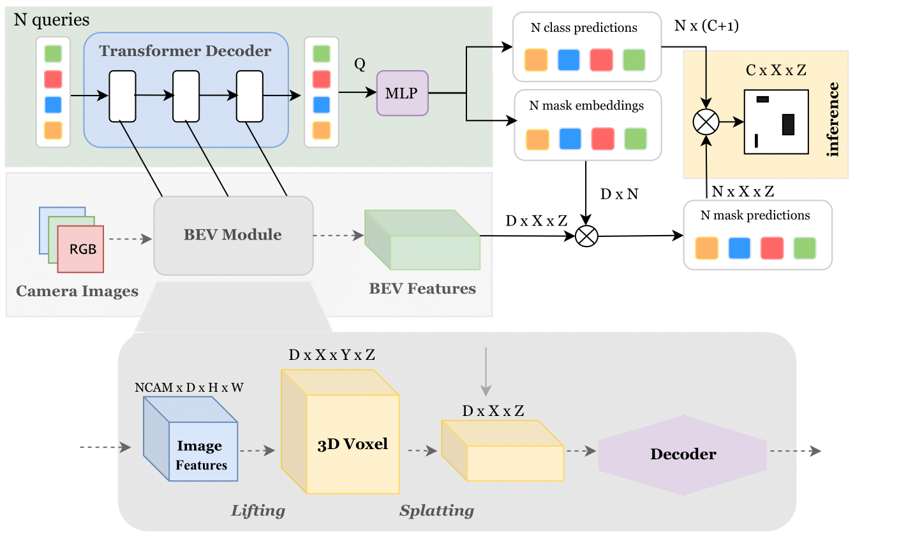
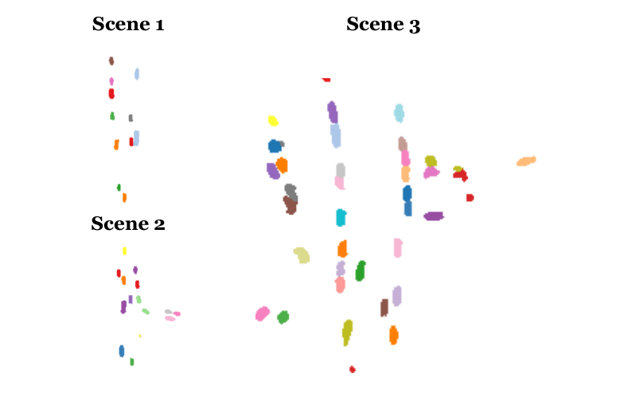

# Mask2Former for Bird's Eye View Representation

The project aims to develop a model that learns different *queries* for each vehicle in bird's eye view (BEV) from multi-camera images, enabling compact and interpretable vehicle representations for downstream tasks like 3D object detection, tracking, and motion forecasting.




## Learned Representations
Different queries successfully learn to identify vehicles in the scene.




### 1\. Clone the Repository
```
git clone https://github.com/mrabiabrn/mask2former4bev.git
cd mask2former4bev
```

### 2\. Setup the Environment
Create a Conda environment and install the required dependencies:
```
conda create -n mask2former4bev
conda activate mask2former4bev
conda install pytorch==2.1.2 torchvision==0.16.2 torchaudio==2.1.2  pytorch-cuda=12.1 -c pytorch -c nvidia
pip install -r requirements.txt
```

### 3\. Download Dataset

Download NuScenes from [this link](https://www.nuscenes.org/) to `root/to/nuscenes`.


### 4\. Training
```
torchrun --master_port 2245 --nproc_per_node=<gpus>  train.py --dataset_path "root/to/dataset"
```


## Acknowledgments
This repository incorporates code from several public works, including [SimpleBEV](https://github.com/aharley/simple_bev), [Mask2Former](https://github.com/facebookresearch/Mask2Former), and [SOLV](https://github.com/gorkaydemir/SOLV). Special thanks to the authors of these projects for making their code available.